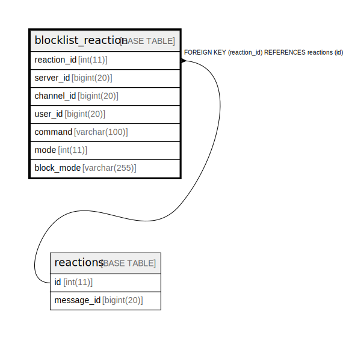

# blocklist_reaction

## Description

<details>
<summary><strong>Table Definition</strong></summary>

```sql
CREATE TABLE `blocklist_reaction` (
  `reaction_id` int(11) DEFAULT NULL,
  `server_id` bigint(20) DEFAULT NULL,
  `channel_id` bigint(20) DEFAULT NULL,
  `user_id` bigint(20) DEFAULT NULL,
  `command` varchar(100) DEFAULT NULL,
  `mode` int(11) DEFAULT NULL,
  `block_mode` varchar(255) DEFAULT NULL,
  KEY `blocklist_reactions_FK` (`reaction_id`),
  CONSTRAINT `blocklist_reactions_FK` FOREIGN KEY (`reaction_id`) REFERENCES `reactions` (`id`) ON DELETE CASCADE ON UPDATE CASCADE
) ENGINE=InnoDB DEFAULT CHARSET=utf8mb4
```

</details>

## Columns

| Name | Type | Default | Nullable | Children | Parents | Comment |
| ---- | ---- | ------- | -------- | -------- | ------- | ------- |
| reaction_id | int(11) | NULL | true |  | [reactions](reactions.md) |  |
| server_id | bigint(20) | NULL | true |  |  |  |
| channel_id | bigint(20) | NULL | true |  |  |  |
| user_id | bigint(20) | NULL | true |  |  |  |
| command | varchar(100) | NULL | true |  |  |  |
| mode | int(11) | NULL | true |  |  |  |
| block_mode | varchar(255) | NULL | true |  |  |  |

## Constraints

| Name | Type | Definition |
| ---- | ---- | ---------- |
| blocklist_reactions_FK | FOREIGN KEY | FOREIGN KEY (reaction_id) REFERENCES reactions (id) |

## Indexes

| Name | Definition |
| ---- | ---------- |
| blocklist_reactions_FK | KEY blocklist_reactions_FK (reaction_id) USING BTREE |

## Relations



---

> Generated by [tbls](https://github.com/k1LoW/tbls)
