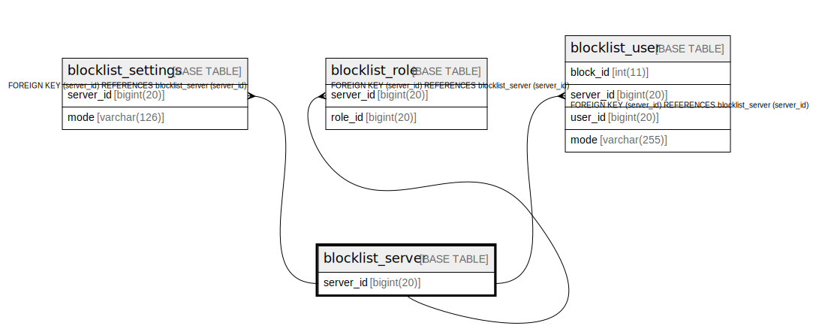

# blocklist_server

## Description

<details>
<summary><strong>Table Definition</strong></summary>

```sql
CREATE TABLE `blocklist_server` (
  `server_id` bigint(20) NOT NULL,
  PRIMARY KEY (`server_id`)
) ENGINE=InnoDB DEFAULT CHARSET=utf8mb4
```

</details>

## Columns

| Name | Type | Default | Nullable | Children | Parents | Comment |
| ---- | ---- | ------- | -------- | -------- | ------- | ------- |
| server_id | bigint(20) |  | false | [blocklist_settings](blocklist_settings.md) [blocklist_role](blocklist_role.md) [blocklist_user](blocklist_user.md) |  |  |

## Constraints

| Name | Type | Definition |
| ---- | ---- | ---------- |
| PRIMARY | PRIMARY KEY | PRIMARY KEY (server_id) |

## Indexes

| Name | Definition |
| ---- | ---------- |
| PRIMARY | PRIMARY KEY (server_id) USING BTREE |

## Relations



---

> Generated by [tbls](https://github.com/k1LoW/tbls)
