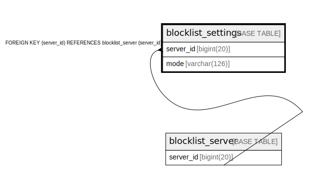

# blocklist_settings

## Description

<details>
<summary><strong>Table Definition</strong></summary>

```sql
CREATE TABLE `blocklist_settings` (
  `server_id` bigint(20) NOT NULL,
  `mode` varchar(126) DEFAULT NULL,
  PRIMARY KEY (`server_id`),
  CONSTRAINT `blocklist_settings_FK` FOREIGN KEY (`server_id`) REFERENCES `blocklist_server` (`server_id`) ON DELETE CASCADE ON UPDATE CASCADE
) ENGINE=InnoDB DEFAULT CHARSET=utf8mb4
```

</details>

## Columns

| Name | Type | Default | Nullable | Children | Parents | Comment |
| ---- | ---- | ------- | -------- | -------- | ------- | ------- |
| server_id | bigint(20) |  | false |  | [blocklist_server](blocklist_server.md) |  |
| mode | varchar(126) | NULL | true |  |  |  |

## Constraints

| Name | Type | Definition |
| ---- | ---- | ---------- |
| blocklist_settings_FK | FOREIGN KEY | FOREIGN KEY (server_id) REFERENCES blocklist_server (server_id) |
| PRIMARY | PRIMARY KEY | PRIMARY KEY (server_id) |

## Indexes

| Name | Definition |
| ---- | ---------- |
| PRIMARY | PRIMARY KEY (server_id) USING BTREE |

## Relations



---

> Generated by [tbls](https://github.com/k1LoW/tbls)
