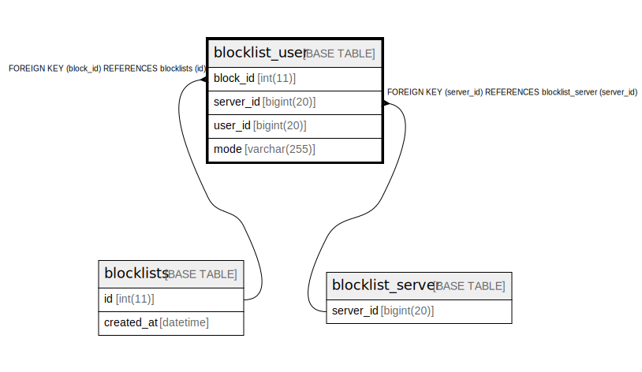

# blocklist_user

## Description

<details>
<summary><strong>Table Definition</strong></summary>

```sql
CREATE TABLE `blocklist_user` (
  `block_id` int(11) DEFAULT NULL,
  `server_id` bigint(20) DEFAULT NULL,
  `user_id` bigint(20) NOT NULL,
  `mode` varchar(255) DEFAULT NULL,
  PRIMARY KEY (`user_id`),
  KEY `blocklist_user_FK` (`block_id`),
  KEY `blocklist_user_FK_1` (`server_id`),
  CONSTRAINT `blocklist_user_FK` FOREIGN KEY (`block_id`) REFERENCES `blocklists` (`id`) ON DELETE CASCADE ON UPDATE CASCADE,
  CONSTRAINT `blocklist_user_FK_1` FOREIGN KEY (`server_id`) REFERENCES `blocklist_server` (`server_id`) ON DELETE CASCADE ON UPDATE CASCADE
) ENGINE=InnoDB DEFAULT CHARSET=utf8mb4
```

</details>

## Columns

| Name | Type | Default | Nullable | Children | Parents | Comment |
| ---- | ---- | ------- | -------- | -------- | ------- | ------- |
| block_id | int(11) | NULL | true |  | [blocklists](blocklists.md) |  |
| server_id | bigint(20) | NULL | true |  | [blocklist_server](blocklist_server.md) |  |
| user_id | bigint(20) |  | false |  |  |  |
| mode | varchar(255) | NULL | true |  |  |  |

## Constraints

| Name | Type | Definition |
| ---- | ---- | ---------- |
| blocklist_user_FK | FOREIGN KEY | FOREIGN KEY (block_id) REFERENCES blocklists (id) |
| blocklist_user_FK_1 | FOREIGN KEY | FOREIGN KEY (server_id) REFERENCES blocklist_server (server_id) |
| PRIMARY | PRIMARY KEY | PRIMARY KEY (user_id) |

## Indexes

| Name | Definition |
| ---- | ---------- |
| blocklist_user_FK | KEY blocklist_user_FK (block_id) USING BTREE |
| blocklist_user_FK_1 | KEY blocklist_user_FK_1 (server_id) USING BTREE |
| PRIMARY | PRIMARY KEY (user_id) USING BTREE |

## Relations



---

> Generated by [tbls](https://github.com/k1LoW/tbls)
