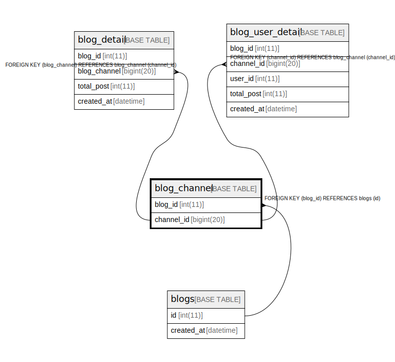

# blog_channel

## Description

<details>
<summary><strong>Table Definition</strong></summary>

```sql
CREATE TABLE `blog_channel` (
  `blog_id` int(11) DEFAULT NULL,
  `channel_id` bigint(20) NOT NULL,
  PRIMARY KEY (`channel_id`),
  KEY `fk_blogs_id_blog_channel` (`blog_id`),
  CONSTRAINT `fk_blogs_id_blog_channel` FOREIGN KEY (`blog_id`) REFERENCES `blogs` (`id`) ON DELETE CASCADE ON UPDATE CASCADE
) ENGINE=InnoDB DEFAULT CHARSET=utf8mb4
```

</details>

## Columns

| Name | Type | Default | Nullable | Children | Parents | Comment |
| ---- | ---- | ------- | -------- | -------- | ------- | ------- |
| blog_id | int(11) | NULL | true |  | [blogs](blogs.md) |  |
| channel_id | bigint(20) |  | false | [blog_detail](blog_detail.md) [blog_user_detail](blog_user_detail.md) |  |  |

## Constraints

| Name | Type | Definition |
| ---- | ---- | ---------- |
| fk_blogs_id_blog_channel | FOREIGN KEY | FOREIGN KEY (blog_id) REFERENCES blogs (id) |
| PRIMARY | PRIMARY KEY | PRIMARY KEY (channel_id) |

## Indexes

| Name | Definition |
| ---- | ---------- |
| fk_blogs_id_blog_channel | KEY fk_blogs_id_blog_channel (blog_id) USING BTREE |
| PRIMARY | PRIMARY KEY (channel_id) USING BTREE |

## Relations



---

> Generated by [tbls](https://github.com/k1LoW/tbls)
