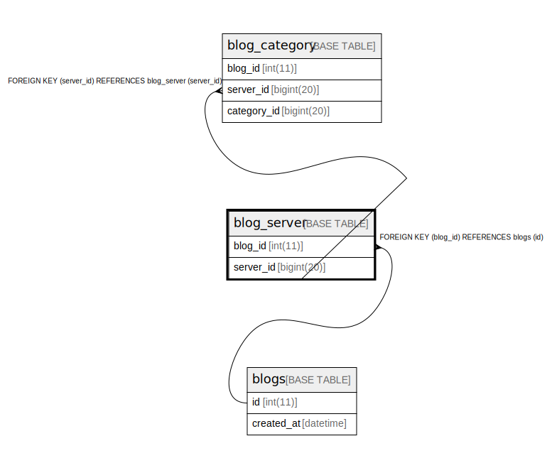

# blog_server

## Description

<details>
<summary><strong>Table Definition</strong></summary>

```sql
CREATE TABLE `blog_server` (
  `blog_id` int(11) DEFAULT NULL,
  `server_id` bigint(20) NOT NULL,
  PRIMARY KEY (`server_id`),
  KEY `fk_blogs_id_blog_server` (`blog_id`),
  CONSTRAINT `fk_blogs_id_blog_server` FOREIGN KEY (`blog_id`) REFERENCES `blogs` (`id`) ON DELETE CASCADE ON UPDATE CASCADE
) ENGINE=InnoDB DEFAULT CHARSET=utf8mb4
```

</details>

## Columns

| Name | Type | Default | Nullable | Children | Parents | Comment |
| ---- | ---- | ------- | -------- | -------- | ------- | ------- |
| blog_id | int(11) | NULL | true |  | [blogs](blogs.md) |  |
| server_id | bigint(20) |  | false | [blog_category](blog_category.md) |  |  |

## Constraints

| Name | Type | Definition |
| ---- | ---- | ---------- |
| fk_blogs_id_blog_server | FOREIGN KEY | FOREIGN KEY (blog_id) REFERENCES blogs (id) |
| PRIMARY | PRIMARY KEY | PRIMARY KEY (server_id) |

## Indexes

| Name | Definition |
| ---- | ---------- |
| fk_blogs_id_blog_server | KEY fk_blogs_id_blog_server (blog_id) USING BTREE |
| PRIMARY | PRIMARY KEY (server_id) USING BTREE |

## Relations



---

> Generated by [tbls](https://github.com/k1LoW/tbls)
