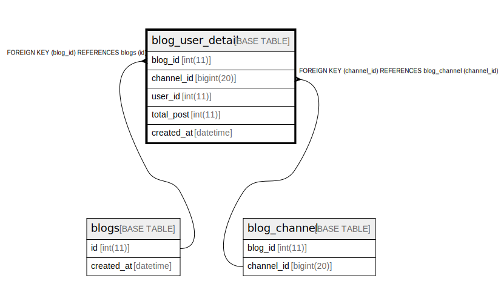

# blog_user_detail

## Description

<details>
<summary><strong>Table Definition</strong></summary>

```sql
CREATE TABLE `blog_user_detail` (
  `blog_id` int(11) NOT NULL,
  `channel_id` bigint(20) DEFAULT NULL,
  `user_id` int(11) DEFAULT NULL,
  `total_post` int(11) DEFAULT NULL,
  `created_at` datetime DEFAULT NULL,
  PRIMARY KEY (`blog_id`),
  KEY `fk_blog_channel_channel_id_blog_user_detail` (`channel_id`),
  CONSTRAINT `fk_blog_channel_channel_id_blog_user_detail` FOREIGN KEY (`channel_id`) REFERENCES `blog_channel` (`channel_id`) ON DELETE CASCADE ON UPDATE CASCADE,
  CONSTRAINT `fk_blogs_id_blog_user_detail` FOREIGN KEY (`blog_id`) REFERENCES `blogs` (`id`) ON DELETE CASCADE ON UPDATE CASCADE
) ENGINE=InnoDB DEFAULT CHARSET=utf8mb4
```

</details>

## Columns

| Name | Type | Default | Nullable | Children | Parents | Comment |
| ---- | ---- | ------- | -------- | -------- | ------- | ------- |
| blog_id | int(11) |  | false |  | [blogs](blogs.md) |  |
| channel_id | bigint(20) | NULL | true |  | [blog_channel](blog_channel.md) |  |
| user_id | int(11) | NULL | true |  |  |  |
| total_post | int(11) | NULL | true |  |  |  |
| created_at | datetime | NULL | true |  |  |  |

## Constraints

| Name | Type | Definition |
| ---- | ---- | ---------- |
| fk_blogs_id_blog_user_detail | FOREIGN KEY | FOREIGN KEY (blog_id) REFERENCES blogs (id) |
| fk_blog_channel_channel_id_blog_user_detail | FOREIGN KEY | FOREIGN KEY (channel_id) REFERENCES blog_channel (channel_id) |
| PRIMARY | PRIMARY KEY | PRIMARY KEY (blog_id) |

## Indexes

| Name | Definition |
| ---- | ---------- |
| fk_blog_channel_channel_id_blog_user_detail | KEY fk_blog_channel_channel_id_blog_user_detail (channel_id) USING BTREE |
| PRIMARY | PRIMARY KEY (blog_id) USING BTREE |

## Relations



---

> Generated by [tbls](https://github.com/k1LoW/tbls)
