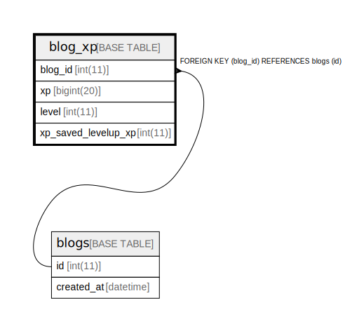

# blog_xp

## Description

<details>
<summary><strong>Table Definition</strong></summary>

```sql
CREATE TABLE `blog_xp` (
  `blog_id` int(11) NOT NULL,
  `xp` bigint(20) DEFAULT NULL,
  `level` int(11) DEFAULT NULL,
  `xp_saved_levelup_xp` int(11) DEFAULT NULL,
  PRIMARY KEY (`blog_id`),
  CONSTRAINT `fk_blogs_id_blog_xp` FOREIGN KEY (`blog_id`) REFERENCES `blogs` (`id`) ON DELETE CASCADE ON UPDATE CASCADE
) ENGINE=InnoDB DEFAULT CHARSET=utf8mb4
```

</details>

## Columns

| Name | Type | Default | Nullable | Children | Parents | Comment |
| ---- | ---- | ------- | -------- | -------- | ------- | ------- |
| blog_id | int(11) |  | false |  | [blogs](blogs.md) |  |
| xp | bigint(20) | NULL | true |  |  |  |
| level | int(11) | NULL | true |  |  |  |
| xp_saved_levelup_xp | int(11) | NULL | true |  |  |  |

## Constraints

| Name | Type | Definition |
| ---- | ---- | ---------- |
| fk_blogs_id_blog_xp | FOREIGN KEY | FOREIGN KEY (blog_id) REFERENCES blogs (id) |
| PRIMARY | PRIMARY KEY | PRIMARY KEY (blog_id) |

## Indexes

| Name | Definition |
| ---- | ---------- |
| PRIMARY | PRIMARY KEY (blog_id) USING BTREE |

## Relations



---

> Generated by [tbls](https://github.com/k1LoW/tbls)
