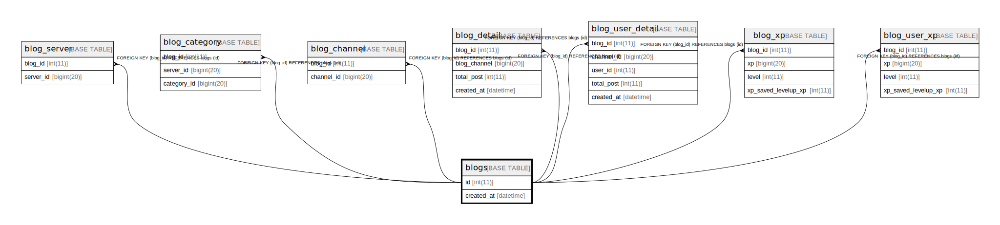

# blogs

## Description

<details>
<summary><strong>Table Definition</strong></summary>

```sql
CREATE TABLE `blogs` (
  `id` int(11) NOT NULL AUTO_INCREMENT,
  `created_at` datetime DEFAULT NULL,
  PRIMARY KEY (`id`),
  KEY `id` (`id`)
) ENGINE=InnoDB DEFAULT CHARSET=utf8mb4
```

</details>

## Columns

| Name | Type | Default | Nullable | Children | Parents | Comment |
| ---- | ---- | ------- | -------- | -------- | ------- | ------- |
| id | int(11) |  | false | [blog_server](blog_server.md) [blog_category](blog_category.md) [blog_channel](blog_channel.md) [blog_detail](blog_detail.md) [blog_user_detail](blog_user_detail.md) [blog_xp](blog_xp.md) [blog_user_xp](blog_user_xp.md) |  |  |
| created_at | datetime | NULL | true |  |  |  |

## Constraints

| Name | Type | Definition |
| ---- | ---- | ---------- |
| PRIMARY | PRIMARY KEY | PRIMARY KEY (id) |

## Indexes

| Name | Definition |
| ---- | ---------- |
| id | KEY id (id) USING BTREE |
| PRIMARY | PRIMARY KEY (id) USING BTREE |

## Relations



---

> Generated by [tbls](https://github.com/k1LoW/tbls)
