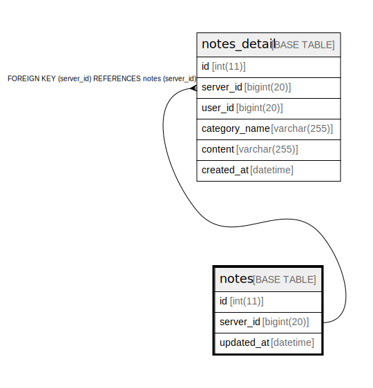

# notes

## Description

<details>
<summary><strong>Table Definition</strong></summary>

```sql
CREATE TABLE `notes` (
  `id` int(11) NOT NULL AUTO_INCREMENT,
  `server_id` bigint(20) NOT NULL,
  `updated_at` datetime DEFAULT current_timestamp(),
  PRIMARY KEY (`server_id`),
  KEY `id` (`id`)
) ENGINE=InnoDB AUTO_INCREMENT=[Redacted by tbls] DEFAULT CHARSET=utf8mb4
```

</details>

## Columns

| Name | Type | Default | Nullable | Children | Parents | Comment |
| ---- | ---- | ------- | -------- | -------- | ------- | ------- |
| id | int(11) |  | false |  |  |  |
| server_id | bigint(20) |  | false | [notes_detail](notes_detail.md) |  |  |
| updated_at | datetime | current_timestamp() | true |  |  |  |

## Constraints

| Name | Type | Definition |
| ---- | ---- | ---------- |
| PRIMARY | PRIMARY KEY | PRIMARY KEY (server_id) |

## Indexes

| Name | Definition |
| ---- | ---------- |
| id | KEY id (id) USING BTREE |
| PRIMARY | PRIMARY KEY (server_id) USING BTREE |

## Relations



---

> Generated by [tbls](https://github.com/k1LoW/tbls)
