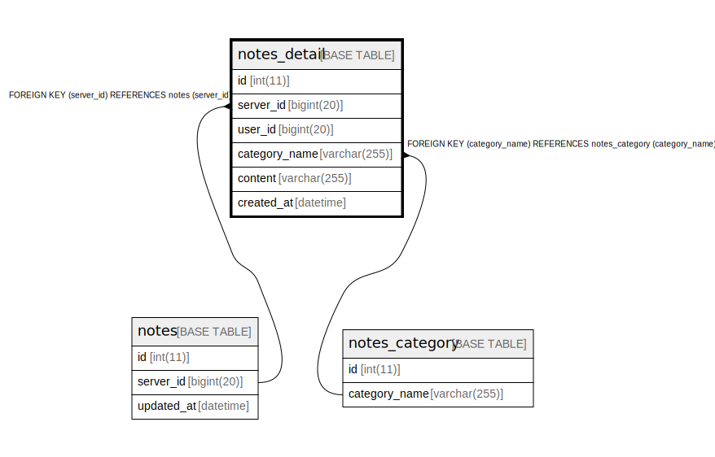

# notes_detail

## Description

<details>
<summary><strong>Table Definition</strong></summary>

```sql
CREATE TABLE `notes_detail` (
  `id` int(11) NOT NULL AUTO_INCREMENT,
  `server_id` bigint(20) DEFAULT NULL,
  `user_id` bigint(20) NOT NULL,
  `category_name` varchar(255) NOT NULL,
  `content` varchar(255) NOT NULL,
  `created_at` datetime DEFAULT current_timestamp(),
  PRIMARY KEY (`user_id`,`content`,`category_name`),
  KEY `id` (`id`),
  KEY `notes_detail_FK` (`server_id`),
  KEY `notes_detail_FK1` (`category_name`),
  CONSTRAINT `notes_detail_FK` FOREIGN KEY (`server_id`) REFERENCES `notes` (`server_id`) ON DELETE CASCADE ON UPDATE CASCADE,
  CONSTRAINT `notes_detail_FK1` FOREIGN KEY (`category_name`) REFERENCES `notes_category` (`category_name`) ON DELETE CASCADE ON UPDATE CASCADE
) ENGINE=InnoDB AUTO_INCREMENT=[Redacted by tbls] DEFAULT CHARSET=utf8mb4
```

</details>

## Columns

| Name | Type | Default | Nullable | Children | Parents | Comment |
| ---- | ---- | ------- | -------- | -------- | ------- | ------- |
| id | int(11) |  | false |  |  |  |
| server_id | bigint(20) | NULL | true |  | [notes](notes.md) |  |
| user_id | bigint(20) |  | false |  |  |  |
| category_name | varchar(255) |  | false |  | [notes_category](notes_category.md) |  |
| content | varchar(255) |  | false |  |  |  |
| created_at | datetime | current_timestamp() | true |  |  |  |

## Constraints

| Name | Type | Definition |
| ---- | ---- | ---------- |
| notes_detail_FK | FOREIGN KEY | FOREIGN KEY (server_id) REFERENCES notes (server_id) |
| notes_detail_FK1 | FOREIGN KEY | FOREIGN KEY (category_name) REFERENCES notes_category (category_name) |
| PRIMARY | PRIMARY KEY | PRIMARY KEY (user_id, content, category_name) |

## Indexes

| Name | Definition |
| ---- | ---------- |
| id | KEY id (id) USING BTREE |
| notes_detail_FK | KEY notes_detail_FK (server_id) USING BTREE |
| notes_detail_FK1 | KEY notes_detail_FK1 (category_name) USING BTREE |
| PRIMARY | PRIMARY KEY (user_id, content, category_name) USING BTREE |

## Relations



---

> Generated by [tbls](https://github.com/k1LoW/tbls)
