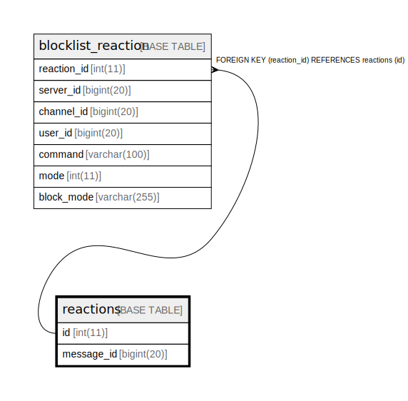

# reactions

## Description

<details>
<summary><strong>Table Definition</strong></summary>

```sql
CREATE TABLE `reactions` (
  `id` int(11) NOT NULL AUTO_INCREMENT,
  `message_id` bigint(20) DEFAULT NULL,
  PRIMARY KEY (`id`),
  KEY `id` (`id`)
) ENGINE=InnoDB DEFAULT CHARSET=utf8mb4
```

</details>

## Columns

| Name | Type | Default | Nullable | Children | Parents | Comment |
| ---- | ---- | ------- | -------- | -------- | ------- | ------- |
| id | int(11) |  | false | [blocklist_reaction](blocklist_reaction.md) |  |  |
| message_id | bigint(20) | NULL | true |  |  |  |

## Constraints

| Name | Type | Definition |
| ---- | ---- | ---------- |
| PRIMARY | PRIMARY KEY | PRIMARY KEY (id) |

## Indexes

| Name | Definition |
| ---- | ---------- |
| id | KEY id (id) USING BTREE |
| PRIMARY | PRIMARY KEY (id) USING BTREE |

## Relations



---

> Generated by [tbls](https://github.com/k1LoW/tbls)
